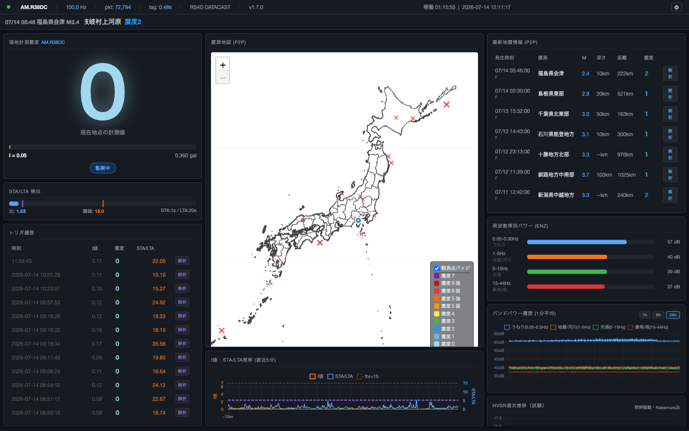

# rs4d-jma-intensity

Raspberry Shake 4D 1台による**個人地震観測所**。リアルタイム震度算出・地震検知・地盤特性（HVSR）解析・月次レポート自動公開までを1つのソフトウェア一式で行います。

## これは何か

Raspberry Shake 4D の UDP ストリームをリアルタイムに受信し、気象庁計測震度を算出・表示するダッシュボードです（ターミナル版 TUI とブラウザ版 Web の2系統）。単なる波形モニタではなく、以下を統合しています。

- リアルタイム震度算出・地震検知（STA/LTA）・音声アラート
- 週次のHVSR（地盤の卓越周波数）モニタリング（試験運用）
- 月次地震レポートの自動生成・GitHub Pages公開
- 気象庁公式観測点と自宅観測点の地盤差の継続検証（ボーリング柱状図・地質図との照合）

地震検出時には macOS `say -v Kyoko` による音声アラートを発します（macOS 専用。VoiceVox は合成遅延が速報性を損なうため現在は無効化し、コードのみ将来用に保持）。

> **注意**: 本ソフトウェアが算出する計測震度は個人観測点による参考値です。公式な震度情報ではありません。防災上の判断は必ず気象庁等の公式発表に基づいて行ってください。

## 一般的なRaspberry Shake利用との違い

Raspberry Shake purchasers は通常、公式アプリ（Station View等）で波形・簡易マグニチュード推定を見るのが一般的な使い方です。本プロジェクトは以下の点で異なります。

- 気象庁計測震度アルゴリズム（JMAフィルタ・0.3秒閾値）をそのまま実装し、公式に近い震度をリアルタイムに算出する
- 常時微動データから地盤の卓越周波数（HVSR）を継続的にモニタリングする
- 月次レポートを自動生成し、地震活動・自局検出状況をGitHub Pagesで公開する
- 気象庁公式観測点との地盤差を、ボーリング柱状図・地質図データと照合して検証する

---

## スクリーンショット



*HVSR週次モニタリングパネル追加後の画面（2026-07-14）。左から現地計測震度・震源地図・最新地震情報、右カラム下部に週次HVSR推移パネル。*

---

## 機能

- Raspberry Shake 4D の DATACAST（UDP）をリアルタイム受信
- 気象庁計測震度アルゴリズム（JMA フィルタ → 0.3 秒閾値 → I = 2log₁₀(a) + 0.94）
- EHZ（速度計）+ ENZ/ENN/ENE（MEMS加速度計）デュアルチャネル方式
  - STA/LTA 検出: EHZ にバンドパスフィルタ（1〜10Hz）を適用して使用（感度向上）
  - I 値計算: ENZ/ENN/ENE 3成分を使用（JMA 定義準拠）
- `rich` ライブラリを使った TUI ダッシュボード（震度バー・波形グラフ・トリガ履歴）
- 震度別音声アラート（macOS `say -v Kyoko` 固定）。ライブ計測震度が震度1相当（計測震度 0.5）を超えた時点で発話し、その後さらに震度スケールが上がれば再生中の読み上げを中断して言い直す
- アラート遅延ログ（トリガ検出 → 発話完了までの時間を JSONL に記録）
- Web ダッシュボード（FastAPI + uvicorn + WebSocket によるリアルタイム配信）
- P2P地震情報 WebSocket API による最新地震情報・EEW（参考）のリアルタイム表示
- P2P地震情報テーブルの「解析」ボタンによるワンクリック波形解析（analyze_rs.py 連携）
- K-NET / KiK-net 強震波形解析（analyze_knet.py、NIEDの強震記録ASCIIをローカル読み込み）
- マイクロセイズム診断図生成（microseism.py、3成分PSD・H/V比・昼夜比較・帯域パワー時系列を1枚に集約）
- HVSR週次モニタリング（hvsr_weekly.py、深夜帯の常時微動データからH/Vスペクトル比を週次で計算・蓄積し、Webダッシュボードに表示。試験運用中。詳細は[HVSRとは](#hvsr水平上下スペクトル比とは)を参照）
- 月次地震レポート生成（monthly_report.py、P2P地震情報から月次HTMLレポートを作成。自局 AM.R38DC のトリガログと照合し各地震の自局検出有無を表示。[GitHub Pagesで公開中](https://masakai.github.io/earthQuake/#reports)）
- UDP シミュレーター（実機なしでのテスト用）
- JMA フィルタ検証スクリプト

---

## ファイル構成

| ファイル | 説明 |
|---------|------|
| `src/jma_intensity_tui.py` | メイン TUI ダッシュボード |
| `src/jma_intensity_web.py` | Web ダッシュボード（FastAPI + uvicorn + WebSocket） |
| `src/jma_intensity_realtime.py` | JMA 計測震度コアライブラリ |
| `src/analyze_rs.py` | P2P地震情報・波形解析スクリプト（FDSN波形取得・スペクトログラム） |
| `src/analyze_knet.py` | K-NET / KiK-net 強震波形解析スクリプト（NIED ASCIIをローカル読み込み・計測震度算出） |
| `src/microseism.py` | R38DC マイクロセイズム診断図生成スクリプト（3成分PSD・H/V比・帯域パワー時系列・昼夜比較） |
| `src/monthly_report.py` | 月次地震レポート生成スクリプト（P2P地震情報から月次HTMLレポートを作成・自局検出照合） |
| `src/fetch_p2p_daily.py` | P2P地震情報の日次データ収集スクリプト（launchd で毎日 03:00 に実行） |
| `src/run_monthly_report_if_last_day.py` | 毎月1日に前月分の月次レポートを生成・公開するラッパー（launchd で毎日 05:00 に実行） |
| `src/simulate_udp.py` | 任意震度の合成波形を UDP 送出するシミュレーター |
| `src/verify_filter.py` | JMA フィルタ特性の検証 pytest スイート（41テスト） |
| `src/test_api_events.py` | `/api/events` の検証 pytest スイート（23テスト） |
| `src/test_template_parity.py` | Jinja2 テンプレートと TUI 表示の整合検証スクリプト |
| `src/templates/dashboard.html` | Web ダッシュボード Jinja2 テンプレート |
| `src/download_geojson.py` | 国土数値情報から市区町村GeoJSONをダウンロード・変換するスクリプト |
| `data/R38DC.xml` | StationXML（R38DC 感度情報） |
| `data/geojson/` | 市区町村別GeoJSONファイル（下記参照） |

---

## 市区町村 GeoJSON データについて

`data/geojson/` 以下に格納されている市区町村の境界ポリゴンデータは、国土交通省が公開する **国土数値情報（行政区域データ N03）** を加工して作成しています。

**出典:** 国土交通省国土数値情報ダウンロードサイト  
https://nlftp.mlit.go.jp/ksj/gml/datalist/KsjTmplt-N03-2024.html

**ライセンス:** 公共データ利用規約（PDL1.0）— 出典記載のうえ商用・非商用を問わず利用可

**加工内容:**  
元データ（都道府県単位の GeoJSON）を市区町村コード（`N03_007`）ごとに分割し、1 市区町村 = 1 ファイル（`{都道府県コード2桁}/{市区町村コード5桁}.json`）として保存しています。座標・属性値（`N03_001` 都道府県名、`N03_004` 市区町村名等）は原データのままで変更していません。

分割作業は `src/download_geojson.py` で自動化されており、同スクリプトを実行すると全 47 都道府県・1905 市区町村のファイルが再生成されます。

---

## 必要環境

- macOS（音声アラートに `say -v Kyoko` を使用。音声機能は macOS 専用）
- Python 3.10 以上

---

## インストール

```bash
git clone <repository-url>
cd earthQuake
python3 -m venv .venv
source .venv/bin/activate
pip install numpy scipy obspy rich websocket-client fastapi uvicorn jinja2 matplotlib
```

---

## クイックスタート

### 1. Raspberry Shake 側の設定

Shake の Web 設定画面で UDP/DATACAST を有効化し、送信先 IP とポート（既定: 8888）を設定します。

### 2. TUI 起動

```bash
.venv/bin/python3 src/jma_intensity_tui.py --station R38DC
```

### 3. シミュレーターでテスト（実機なし）

ターミナル 1 でTUI を起動：
```bash
.venv/bin/python3 src/jma_intensity_tui.py --station R38DC --rt-window 5 --lta 10 --bind 127.0.0.1:9999
```

ターミナル 2 でシミュレーターを起動：
```bash
.venv/bin/python3 src/simulate_udp.py --intensity 3.0 --duration 60 --quiet-sec 20 --dest 127.0.0.1:9999
```

### 4. Web ダッシュボード起動

```bash
bash scripts/start_web.sh
```

FastAPI + uvicorn で HTTP サーバー（既定ポート 8080）を起動し、UDP（既定ポート 8888）を受信します。ブラウザで `http://localhost:8080/` を開くと、WebSocket でリアルタイムに震度・波形が更新されます。

---

## Web API エンドポイント

Web ダッシュボードが提供する主な HTTP / WebSocket エンドポイントです。

| エンドポイント | 用途 |
|---------|------|
| `GET /` | ダッシュボード HTML |
| `WebSocket /ws` | 震度・波形・トリガ履歴のリアルタイム配信 |
| `POST /api/config` | 受信・検出パラメータの更新 |
| `POST /api/analyze` ・ `GET /api/analyze/{job_id}` ・ `GET /api/analyze_img/{job_id}` | 波形解析ジョブの投入・状態取得・画像取得 |
| `GET /api/stations` | 観測点一覧 |
| `GET /api/geojson/{pref}` ・ `GET /api/geojson/{pref}/{city}` | 市区町村 GeoJSON 取得 |
| `GET /api/version` | アプリバージョン（例: `{"version":"1.7.0"}`） |
| `GET /api/events` | トリガ履歴 JSON（読み取り専用・無認証。外部連携用） |
| `GET /api/hvsr_history` | HVSR週次モニタリング履歴 JSON（読み取り専用・無認証） |

---

## 音声アラート

macOS の `say -v Kyoko` で読み上げます（macOS 専用。VoiceVox の合成遅延が速報性を損なうため現在は無効化し、コードのみ将来用に保持。再有効化手順は MANUAL.md を参照）。

ライブ計測震度が震度1相当（計測震度 0.5）を超えた時点で発話します。

| 震度 | 警告語 |
|------|--------|
| 1〜2 | 「揺れを検出。」 |
| 3〜4 | 「注意！地震です。」 |
| 5弱・5強 | 「警告！強い地震です。」 |
| 6弱以上 | 「緊急警報！非常に強い地震です。」 |

### K-NET / KiK-net データ謝辞

本ソフトウェアの `src/analyze_knet.py` は、防災科学技術研究所（NIED）が公開する K-NET / KiK-net 強震観測網のデータを利用しています。このデータを利用した成果物（論文・学会発表・報告書等）を公表する場合は、以下の謝辞・DOI を本文の謝辞または Data Availability セクションに明記してください。

**日本語:**
```
本研究では防災科学技術研究所が整備・公開するK-NET・KiK-netの強震観測データを使用した。
防災科学技術研究所 (2019) 防災科研K-NET・KiK-net. doi:10.17598/NIED.0004
```

**English:**
```
Strong-motion data from K-NET and KiK-net were provided by the National Research
Institute for Earth Science and Disaster Resilience (NIED).
National Research Institute for Earth Science and Disaster Resilience (2019)
NIED K-NET, KiK-net. doi:10.17598/NIED.0004
```

- 生成画像のフッターにも DOI を自動記載します。
- データの再配布・販売・改ざんは禁止されています。詳細は [NIED 公開データについて](https://www.kyoshin.bosai.go.jp/ja/about_pubdata/) を参照してください。

---

### 音声クレジット表記

本ソフトウェアの音声アラートは VOICEVOX を利用しています。VoiceVox Engine が起動している環境で本ソフトウェアを利用・配信・配布する場合は、以下のクレジット表記をユーザーが確認可能な場所（README・配信概要欄・アプリ情報画面等）に記載してください。

```
VOICEVOX:青山龍星
```

- 青山龍星はクレジット表記により商用・非商用問わず利用可能です（クレジット非表示の商用利用は別途契約が必要）。
- VoiceVox の他キャラクター（ずんだもん・四国めたん等）に変更する場合は、各キャラクターの利用規約・クレジット表記を必ず確認してください。
- 共通の禁止事項（公序良俗違反、政治・宗教活動、情報商材、フェイク情報、風俗営業、反社会的勢力による利用等）に注意してください。
- 詳細は [VOICEVOX 公式サイト](https://voicevox.hiroshiba.jp/) 内の各キャラクター利用規約を参照してください。

---

## 計測震度アルゴリズムの正当性検証

本ソフトウェアの計測震度算出ロジックを、防災科研（NIED）が公開する K-NET 強震記録の公式統計値と照合しました。

**検証イベント:** 2026年5月20日 11:46（震源 27.500°N, 128.600°E、深さ 50 km、M5.9）

| 観測点 | 震央距離 | 公式値 (NIED) | 解析値 (本ソフト) | 一致度 |
|---|---|---|---|---|
| KGS035（与論） | 53 km | 312.3 gal / I=5.0 | 293.9 gal / I=5.08 | 震度階級完全一致 |
| KGS034（知名） | 19 km | 150.0 gal / I=4.2 | 147.4 gal / I=4.29 | 震度階級完全一致 |

加速度の差（−6%、−2%）は、公式値が成分別最大、本ソフトが3成分ベクトル合成最大という算出手法の違いによります。計測震度値は両観測点とも公式値と +0.08 〜 +0.09 の範囲で一致しており、JMA 計測震度の階級（震度3〜5強）と完全に一致しました。

**検証された範囲:**
- `src/jma_intensity_realtime.py` の JMA フィルタ（`apply_jma_filter_time`）と震度計算（`jma_scale_from_I`）
- `src/analyze_rs.py` の `compute_intensity_timeseries`（0.3秒持続値抽出）
- `src/analyze_knet.py` の単位変換・3成分ベクトル合成・震源距離計算

**検証範囲外（参考値として扱うべき機能）:**
- リアルタイム UDP 受信（TUI/Web）、STA/LTA 検出、P2P 地震情報表示、UDP シミュレーター
- 上記検証範囲外の震度（震度6弱以上・震度2以下）、震央距離100km超

検証手順の詳細は [MANUAL.md](docs/MANUAL.md) を参照してください。

---

## HVSR（水平/上下スペクトル比）とは

深夜帯の常時微動データから、水平動と上下動のスペクトル比（Nakamura法）を週次で計算し、観測地点の地盤の卓越周波数（揺れやすい周波数帯）をモニタリングする機能です（`src/hvsr_weekly.py`）。

- **計算方法**: 40秒窓・50%オーバーラップ・STA/LTAによる地震区間の除外・Konno-Ohmachi平滑化。SESAME (2004) ガイドラインの信頼性クライテリアの一部（3項目）を参考記録として算出します。
- **試験運用中**: 2026年7月に導入したばかりで、現時点ではデータの蓄積が浅く、卓越周波数の傾向はまだ確立していません。Webダッシュボードに週次推移パネルとして表示されます。
- **Vs30・地盤種別は判定しません**: 本機能はH/V比・卓越周波数という直接観測量のみを扱い、地盤の物性値（Vs30等）や地盤種別への変換・断定は行っていません。
- リアルタイム系（震度算出・地震検知）とは完全に独立したバッチ処理であり、既存のリアルタイム性には影響しません。既存のダッシュボードには読み取り専用APIとして反映されるのみです。

詳細は [MANUAL.md「16. HVSR週次モニタリング」](docs/MANUAL.md#16-hvsr週次モニタリング)を参照してください。

---

## 制約・精度上の注意

- 本ソフトウェアが算出する計測震度・HVSR等の解析値は、いずれも個人観測点（AM.R38DC、静岡県三島市）による**参考値**です。気象庁の公式発表を代替するものではありません。
- 自宅観測点は箱根西麓の軟弱地盤（ローム層厚い）に位置し、近隣の気象庁公式観測点（硬質地盤）より震度が高めに出る傾向があります。詳細は月次レポートの「自局トピック」を参照してください。
- 計測震度アルゴリズムの検証範囲は上記「正当性検証」節の通りで、震度6弱以上・震度2以下・震央距離100km超は検証範囲外です。
- HVSR機能は試験運用中で、データ蓄積量が少ないため結果の解釈には注意が必要です。
- 防災上の判断は、本システムの表示のみに依存せず、必ず気象庁等の公式情報を確認してください。

---

## 関連記事

- [Qiita: 実装解説記事](https://qiita.com/masakai/items/2d34f728aaa597d721e7) — 計測震度算出ロジックの技術解説
- [ブログ: 開発の経緯](https://masakai.github.io/tags/raspberry-shake/) — 設置のきっかけから地盤差の発見、地質調査までの記録
- [プロジェクトサイト（GitHub Pages）](https://masakai.github.io/earthQuake/) — スクリーンショット・月次レポート一覧

---

## 詳細

詳しい使い方・オプション・アルゴリズム解説は [MANUAL.md](docs/MANUAL.md) を参照してください。

変更履歴は [CHANGELOG.md](docs/CHANGELOG.md) を参照してください。

---

Copyright (c) 2026 Masanori Sakai
